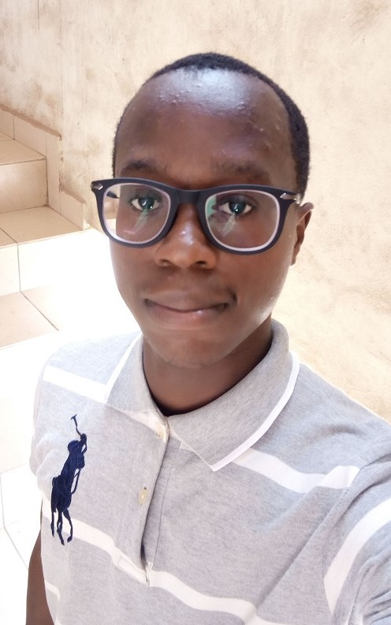

 
> Hello everyone, welcome to my first blog post, I am Lawal Oladotun, I am
> an aspiring fullstack developer, I have taken udemy courses on react where I have learnt tons of
> stuff mainly from the Zero To Mastery group with my major tutors being Andrei and Yihua.
> I have learnt about React, Redux, Firebase, PostgreSQL, React Hooks, React-router-dom, Gatsby,
> graphQl, Styled-Components and soo much more. I am still learning and taking more courses so as to enable
> me attain my goal as a full stack developer.
