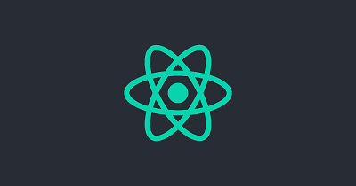

<!--  -->

React, React, React, I know many have been wondering what React is all about, I was in your shoes some months back, ...lol
if you guessed right, what i did first was to Google, If you are like me then, check the official react documentation here --insert links. or better still let's talk a little about what i know about react below ......

What is React ?

React is a UI library that was created to aid the development of views of web apps by making it better, more efficient and less tedious for web developers. It uses the approach of creating a virtual DOM (Document Object Model) that helps us to render the views we desire on our DOM which is then shown to our clients making use of our web apps. React was built on javascript and was developed at Facebook.

In react, we have four major concepts we need to understand

1 React is declarative

React is declarative, ie: doesn't manipulate the DOM, rather it repaints the DOM

2 React builds websites like Lego blocks

In react, we build our web apps like lego blocks using the concept of components. Lets picture this, we are building a static site that has an header, cover and a footer. In reacts all these blocks will be classified as components thats makes up the sites. The components can either be a class or functional component. Class components are actually becoming less relevant due to the introduction of hooks which now allows us to now call our states in functional components. Class components were mainly used before the addition of hooks because of the capability of holding states.

3 React makes use of unidirectional data flow.

4 React is all about the User Interface, the rest is all to you the developer.
